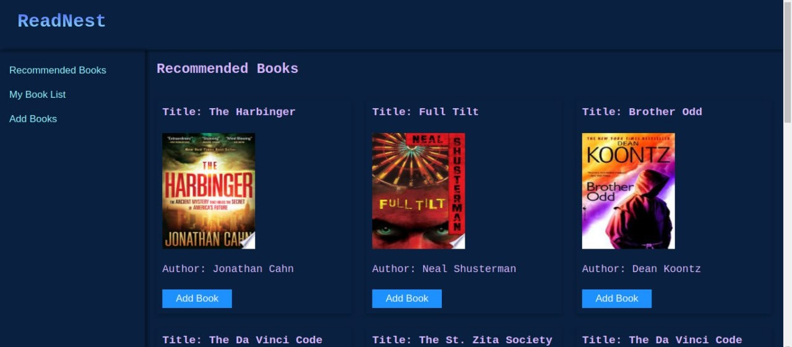

.png)
# ReadNest

ReadNest is a simple book read list site that helps users keep track of the books they want to read. The platform offers functionalities such as authentication, genre categorization, and fetching book details from external sources.

## Features

- User authentication (signup and login)
- Categorization of books by genre
- Fetching book details from external sources based on the title
- Personalized book recommendations based on the genres users have read
- User-friendly interface

## Screenshots

## Getting Started

To start using **ReadNest**, follow these steps:

1. **Sign Up**: Create a new account by clicking the "Sign Up" button and entering your details.
2. **Log In**: If you already have an account, simply log in using your credentials.
3. **Explore**: Use the search bar to find books or browse through genres.
4. **Add to Your List**: Click on any book to add it to your personalized reading list.
5. **Track Your Progress**: Mark books as read or update your list anytime.

## Tech Stack

- **Frontend**:
  
    

- **Backend**:

   

- **Database**:

  

## Contributors

- [**Abel**](https://github.com/Abels-dev)
- [**Henok Asaye**](https://github.com/HenokAsaye)
- [**Amir Yassin**](https://github.com/amir-eth)

## How to Use

1. Visit the [ReadNest website](https://read-nest-delta.vercel.app/signup.html) to get started.
2. Sign up or log in to your account.
3. Browse books by genre or search for specific titles.
4. Add books to your read list.

## Thank you for choosing **ReadNest*
